# Simplified Debt Chain System Flow
## Direct Progressive Settlement Only

The Debt Chain system enables trustless debt management through direct progressive settlements. The system automatically detects potential debt chains upon debt creation, allowing creditors to collect payments directly from the initial debtor in the chain. For example, if Alice owes Bob and Bob owes Charlie, the smart contract enables Charlie to receive payments directly from Alice once Bob consents to the chain resolution. This direct payment approach ensures maximum efficiency, reduces complexity, and minimizes transaction costs while maintaining the trustless nature of the system.

### Core Debt Chain Flow
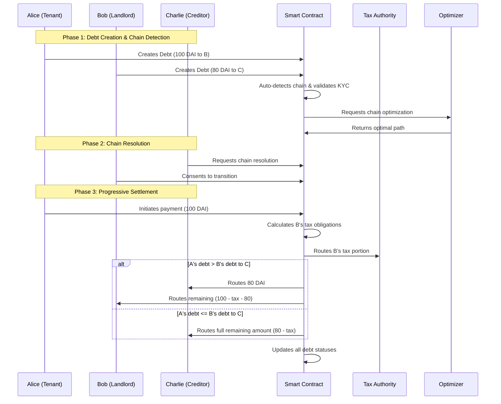

### Settlement Process
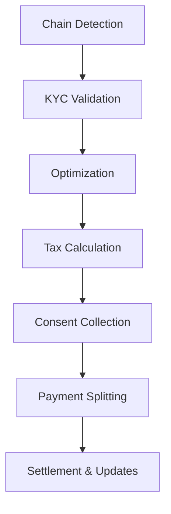

### Transaction Flow
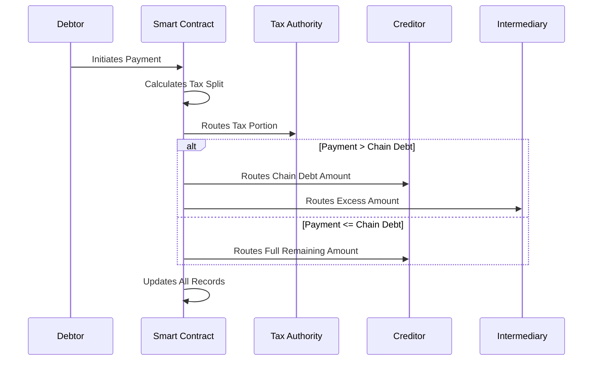

### Complete System Flow

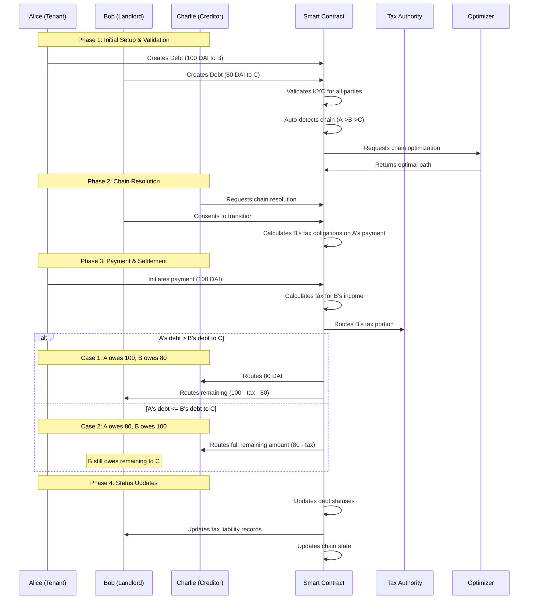

### Complete System Flow Explanation

The debt chain system operates through a series of well-defined phases. Initially, when Alice (tenant) creates a debt to Bob (landlord), and Bob has an existing debt to Charlie, the smart contract automatically detects this potential chain. After KYC validation and chain optimization, Charlie can request chain resolution, requiring Bob's consent. The payment flow then diverges into two scenarios based on the debt amounts:

**Case 1: Alice's Debt Exceeds Chain Requirement**
When Alice owes more to Bob (100 DAI) than Bob owes to Charlie (80 DAI), Alice initiates a payment of 100 DAI. The smart contract first calculates and routes Bob's tax obligations from this rental income to the tax authority. Then, it routes 80 DAI to Charlie (satisfying Bob's debt), and the remaining amount (100 - tax - 80) returns to Bob. This ensures Bob receives his excess portion while maintaining proper tax compliance.

**Case 2: Alice's Debt Matches or is Less Than Chain Requirement**
When Alice's debt (say 80 DAI) is less than or equal to Bob's debt to Charlie (100 DAI), Alice's payment (after tax deduction) is routed entirely to Charlie. In this case, Bob's debt to Charlie is partially settled, and Bob remains responsible for the outstanding balance. This scenario maintains the chain's efficiency while ensuring proper tax attribution to Bob as the landlord.

In both cases, the system maintains a clear record of tax obligations, debt settlements, and remaining balances, ensuring transparency and regulatory compliance throughout the chain resolution process. 

This complete flow demonstrates:
- Full KYC integration
- Automated chain detection
- Tax handling
- Payment splitting
- Status management

### System Features

1. **Automatic Chain Detection**
   - Immediate identification of potential chains
   - Optimization of payment routes
   - Real-time status updates

2. **Direct Settlement Process**
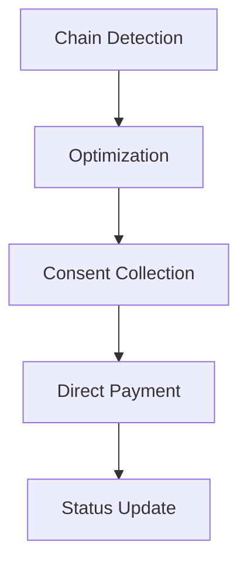

### Transaction Efficiency

1. **Base Operations**
   - Initial debt creation: 1 tx per debt
   - Chain resolution setup: 1 tx (consent)
   - Payments: 1 tx per payment

2. **Optimization Features**
   - Payment batching
   - Minimum payment thresholds
   - Transaction bundling

### Benefits
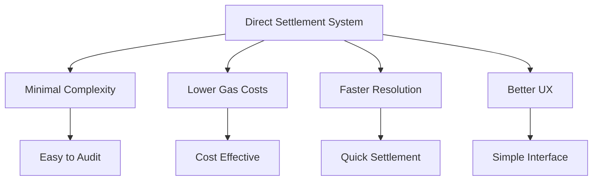

### Implementation Focus
1. **Smart Contract Optimization**
   - Efficient chain detection algorithms
   - Gas-optimized payment routing
   - Streamlined consent management

2. **Security Considerations**
   - Simplified attack surface
   - Clear permission structure
   - Straightforward validation rules

3. **User Experience**
   - Intuitive debt creation
   - Transparent chain resolution
   - Clear payment tracking 

### System Evaluation

#### Transaction Cost Analysis
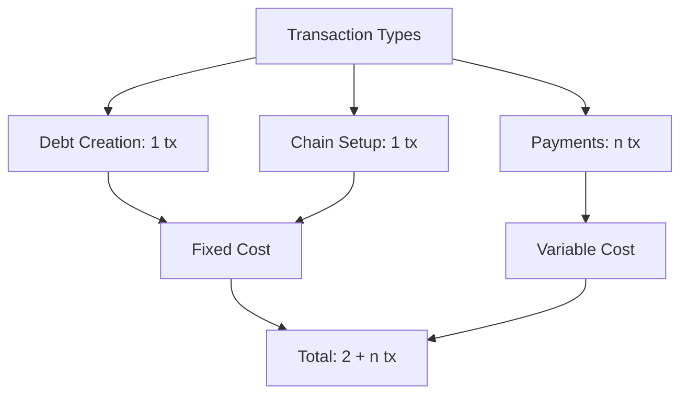

#### Efficiency Metrics

1. **Best Case Scenarios**
   - Single large payment settlements
   - Short chains (2-3 participants)
   - Immediate consent from intermediaries
   - Batched multiple debt resolutions

2. **Optimization Potential**
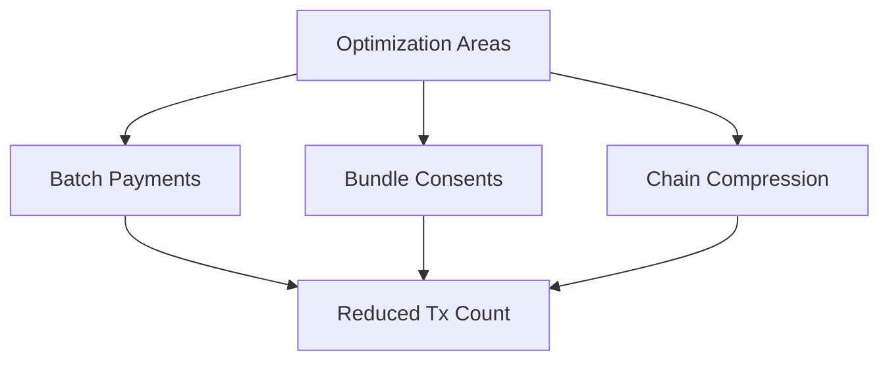

#### Performance Characteristics

1. **Gas Efficiency**
   - No escrow deployment costs
   - Minimal state changes per transaction
   - Optimized chain detection logic

2. **Scalability Factors**
   - Linear transaction growth with chain length
   - Constant gas cost for basic operations
   - Predictable performance patterns

#### Risk Assessment

1. **Technical Risks**
   - Chain detection accuracy
   - Consent management reliability
   - Payment routing efficiency

2. **Mitigation Strategies**
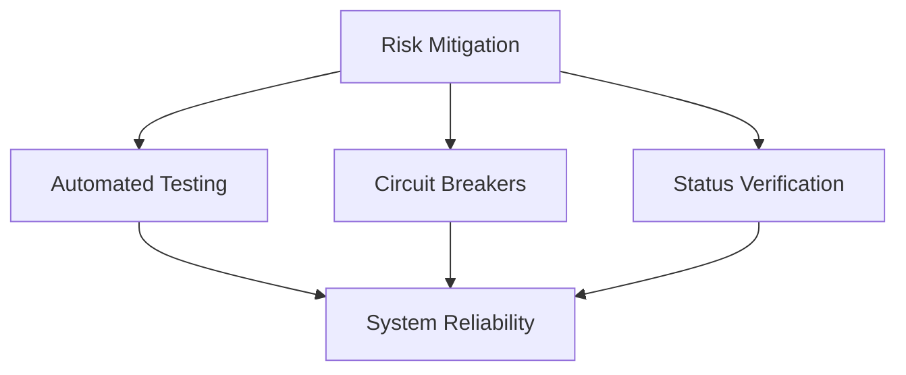

#### System Advantages

1. **Operational Benefits**
   - Predictable gas costs
   - Simple debugging process
   - Clear state transitions
   - Easy system monitoring

2. **User Benefits**
   - Immediate settlement capability
   - Transparent chain status
   - Straightforward interface
   - Lower transaction fees 

## Objectives and System Impact

### Financial System Evolution
- **Payment Network Consolidation**: As more contracts (rent, loans, installments) join the system, payment flows naturally consolidate toward major creditors (banks, financial institutions)
- **Debt Graph Optimization**: The system would automatically identify and optimize payment routes, reducing intermediary steps
- **Natural Financial Hubs**: Banks and financial institutions emerge as terminal nodes in most debt chains

### Economic Benefits
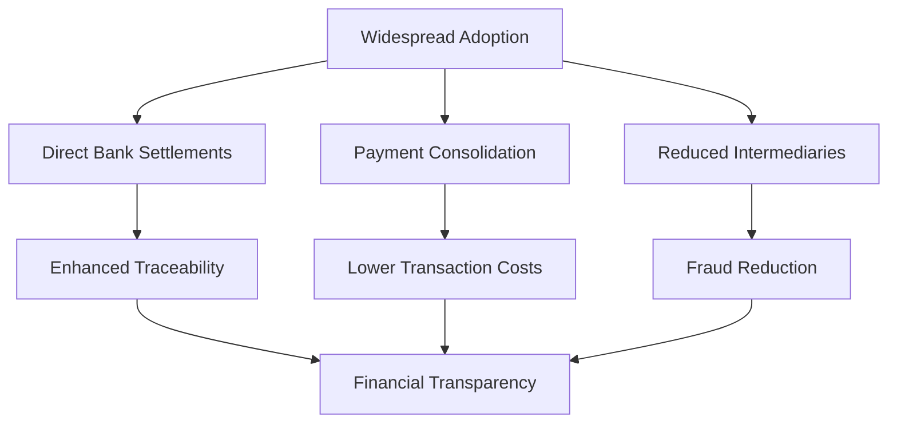

### Systemic Improvements
1. **Financial Transparency**
   - Direct traceability of payment sources
   - Clear audit trails for all transactions
   - Automated income verification

2. **Fraud Prevention**
   - Reduced payment layering
   - Immediate detection of circular debts
   - Transparent source of funds

3. **Market Efficiency**
   - Automated debt discovery and resolution
   - Reduced settlement times
   - Lower operational costs

### Social Impact
- Democratized access to financial infrastructure
- Reduced dependency on traditional intermediaries
- Enhanced trust in financial transactions 

### Regulatory and Practical Challenges

While the debt chain system offers significant efficiency improvements, it introduces complex regulatory challenges. 

The primary concern is tax compliance: as payments bypass intermediate parties, there's a risk of income misattribution and potential tax evasion. For instance, when rent payments flow directly from tenant to a final creditor, bypassing the landlord's formal receipt, it could complicate tax reporting and create opportunities for tax avoidance. Additionally, the system must address money laundering risks, ensure proper income declaration, and maintain clear audit trails for all participants. 

These challenges are particularly acute in cross-border transactions where multiple tax jurisdictions and regulatory frameworks intersect.

#### Tax Implications and Solutions
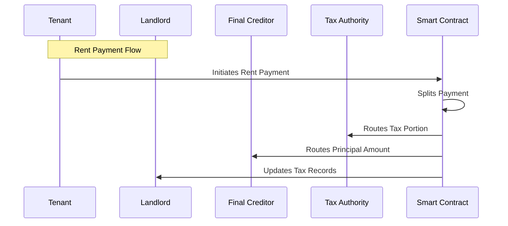

1. **Income Attribution Challenges**
   - Need to track original income sources
   - Tax liability remains with service provider
   - Required separate accounting for tax purposes

2. **Technical Solutions**
   - Automated tax calculations
   - Direct tax authority payments
   - Real-time tax reporting
   - Income source tagging

#### Additional Transaction Overhead
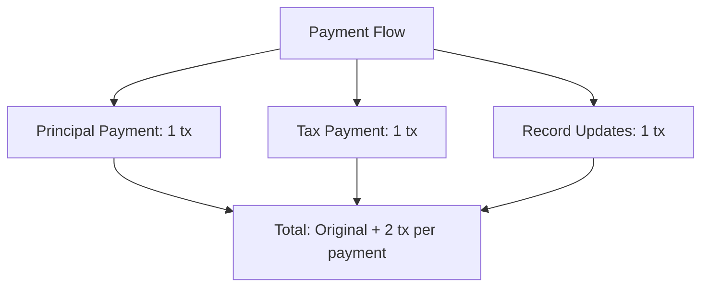

#### Regulatory Requirements

1. **Compliance Needs**
   - KYC/AML integration
   - Tax reporting mechanisms
   - Regulatory reporting APIs
   - Audit trail maintenance

2. **Cross-Border Considerations**
   - Different tax jurisdictions
   - Various reporting requirements
   - Currency conversion implications
   - International payment regulations

#### Implementation Recommendations

1. **Smart Contract Extensions**
   - Tax calculation modules
   - Regulatory reporting facets
   - Multi-jurisdiction support
   - Payment splitting logic

2. **Operational Adjustments**
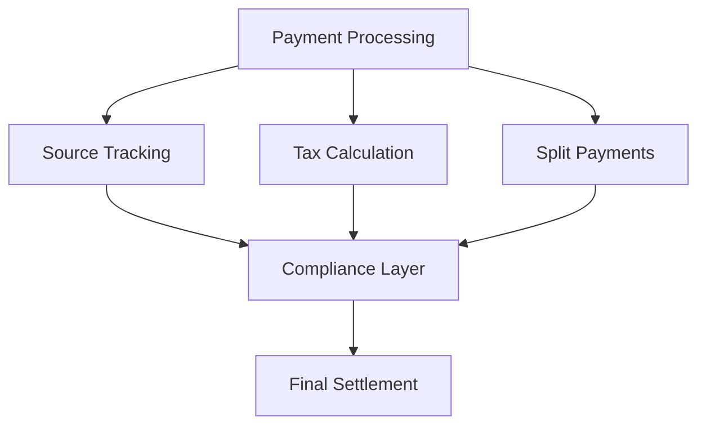

#### Cost-Benefit Analysis

1. **Additional Costs**
   - Increased transaction count
   - Complex smart contract logic
   - Regulatory compliance overhead
   - Integration with tax systems

2. **Offsetting Benefits**
   - Automated tax compliance
   - Reduced manual reporting
   - Real-time tax collection
   - Improved audit capability

#### Risk Mitigation Strategies

1. **Technical Risks**
   - Payment splitting accuracy
   - Tax calculation precision
   - Cross-border compliance

2. **Operational Risks**
   - Regulatory changes
   - Tax rate updates
   - Jurisdiction conflicts

3. **Solutions**
   - Modular contract design
   - Regular compliance updates
   - Flexible tax parameters
   - Jurisdictional plugins 

### National Implementation Impact

A country-wide implementation of the debt chain system, restricted to KYC-verified citizens and entities, could revolutionize the national financial infrastructure:

#### Economic Transformation
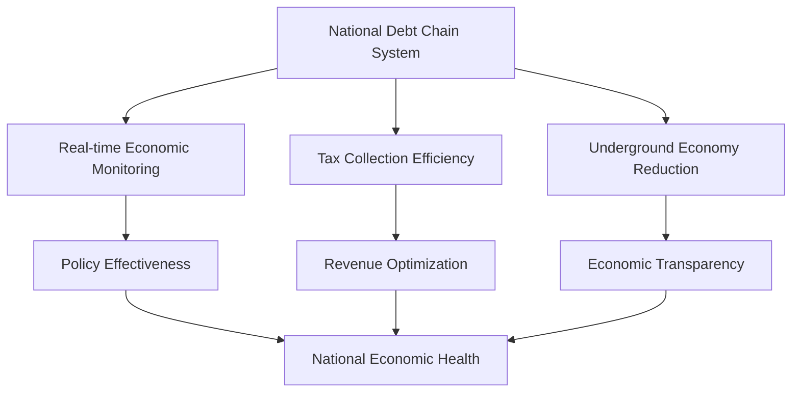

1. **Monetary Policy Benefits**
   - Real-time visibility of national debt flows
   - Immediate impact assessment of policy changes
   - Better control over money velocity
   - Enhanced economic forecasting

2. **Financial Crime Prevention**
   - Reduction in money laundering
   - Prevention of tax evasion
   - Traceable transaction history
   - Automated regulatory compliance

3. **Economic Efficiency**
   - Reduced transaction costs nationally
   - Faster debt resolution
   - Lower administrative overhead
   - Improved capital efficiency

4. **Social Benefits**
   - Financial inclusion
   - Reduced predatory lending
   - Transparent credit history
   - Equal access to financial services

#### Implementation Requirements
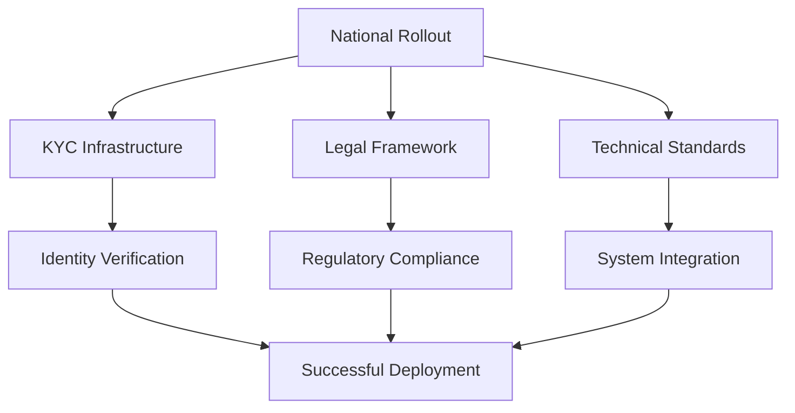
