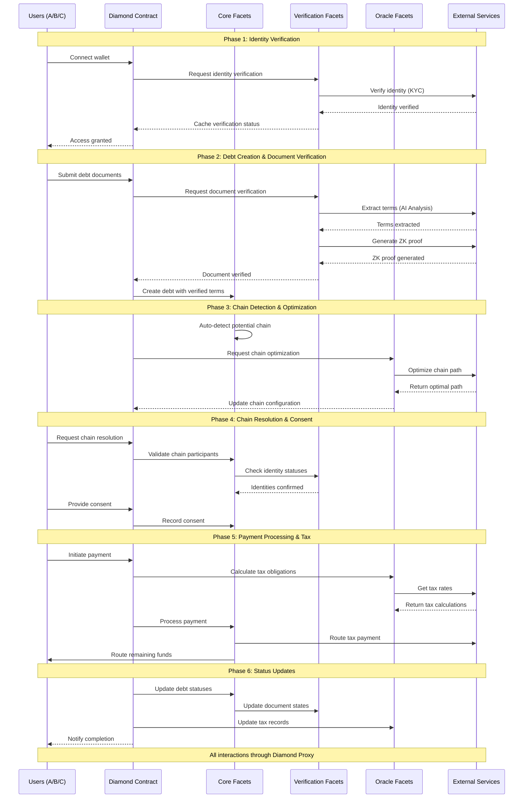

# DebtChain System Flow

## System Components

### Core Components
1. Diamond Contract (Main Proxy)
2. Core Facets (Debt, Chain, Payment, Access Control)
3. Oracle Facets (Tax, Chain Optimizer)
4. Verification Facets (Identity, Document)
5. Storage Libraries

### External Services
1. Identity Verification Service
2. Document Verification Service
3. AI Analysis Service
4. ZK Proof Service
5. Tax Service
6. Chain Optimization Service

## Detailed Flow Diagram

## Key Points

1. **User Interaction**
   - All user interactions go through the Diamond proxy
   - Diamond delegates to appropriate facets

2. **Facet Organization**
   - Core Facets: Basic debt and chain operations
   - Verification Facets: Identity and document verification
   - Oracle Facets: External service integration

3. **External Services**
   - Identity verification (KYC)
   - Document analysis (AI)
   - Privacy (ZK Proofs)
   - Tax calculations
   - Chain optimization

4. **Security Flow**
   - Identity verification required first
   - Document verification before debt creation
   - Consent required for chain resolution
   - Privacy preserved through ZK proofs

5. **Payment Flow**
   - Tax calculation before routing
   - Automatic payment splitting
   - Status updates across all components 