```mermaid
graph TB
    %% External Actors
    User((User))
    Admin((Admin))

    subgraph Diamond["Diamond Contract (Proxy)"]
        direction TB
        
        subgraph CoreFacets["Core Facets"]
            direction LR
            DF[DebtFacet]
            CF[ChainFacet]
            PF[PaymentFacet]
            AF[AccessControlFacet]
            TF[TaxFacet]
        end
        
        subgraph OracleFacets["Oracle Facets"]
            direction LR
            TO[TaxOracleFacet]
            CO[ChainOptimizerFacet]
            KO[KYCOracleFacet]
        end
    end
    
    subgraph ExternalSystems["External Systems"]
        direction LR
        TS[Tax Service]
        OS[Optimization Service]
        KS[KYC Service]
    end
    
    subgraph Storage["Diamond Storage"]
        direction LR
        DS[(DebtStorage)]
        CS[(ChainStorage)]
        AS[(AccessStorage)]
        TSt[(TaxStorage)]
    end

    %% Center alignment for Notes
    subgraph Notes["System Notes"]
        direction TB
        note1["All user interactions go through Diamond Proxy"]
        note2["Oracle facets cache external data to minimize gas costs"]
        note3["Each facet has isolated storage at unique positions"]
        note4["Admin controls roles and system parameters"]
    end
    
    %% User flows through Diamond
    User --> Diamond
    Diamond --> DF
    Diamond --> CF
    Diamond --> PF
    
    %% Admin flows through Diamond
    Admin --> Diamond
    Diamond --> AF
    Diamond --> TF
    
    %% Core Facet Storage Interactions
    DF <-->|"Store/Read Debt Data"| DS
    CF <-->|"Store/Read Chain Data"| CS
    PF <-->|"Store/Read Payment Data"| DS
    PF <-->|"Read Tax Data"| TSt
    AF <-->|"Store/Read Access Rights"| AS
    TF <-->|"Store/Read Tax Data"| TSt
    
    %% Oracle-External System Interactions
    TO <-->|"Get Tax Rates/Submit Reports"| TS
    CO <-->|"Get Optimal Routes"| OS
    KO <-->|"Verify Identity"| KS
    
    %% Oracle-Storage Interactions
    TO <-->|"Cache Tax Data"| TSt
    CO <-->|"Cache Route Data"| CS
    KO <-->|"Cache KYC Status"| AS
    
    %% Cross-Facet Dependencies
    DF -->|"Check KYC"| AF
    CF -->|"Verify Access"| AF
    PF -->|"Verify Access"| AF
    PF -->|"Calculate Tax"| TF
    
    %% Styling
    classDef coreStyle fill:#6495ED,stroke:#333,stroke-width:2px
    classDef oracleStyle fill:#DDA0DD,stroke:#333,stroke-width:2px
    classDef externalStyle fill:#98FB98,stroke:#333,stroke-width:2px
    classDef storageStyle fill:#FFA07A,stroke:#333,stroke-width:2px
    classDef proxyStyle fill:#E6E6FA,stroke:#333,stroke-width:4px
    classDef actorStyle fill:#FFD700,stroke:#333,stroke-width:2px
    classDef notesStyle fill:#fff,stroke:#333,stroke-width:1px
    
    class DF,CF,PF,AF,TF coreStyle
    class TO,CO,KO oracleStyle
    class TS,OS,KS externalStyle
    class DS,CS,AS,TSt storageStyle
    class Diamond proxyStyle
    class User,Admin actorStyle
    class Notes notesStyle

    %% Layout hints
    Notes --> ExternalSystems
    Notes --> Storage
```

# System Flow Description

## Core Components Interaction

1. **User Interactions**
   - Users interact primarily with DebtFacet, ChainFacet, and PaymentFacet
   - All user actions require KYC verification through AccessControlFacet
   - Payments trigger tax calculations via TaxFacet

2. **Oracle Services**
   - TaxOracleFacet: Interfaces with external tax service for rates and compliance
   - ChainOptimizerFacet: Optimizes debt chains using external optimization service
   - KYCOracleFacet: Verifies user identity and compliance status

3. **Storage Management**
   - Each facet has isolated storage
   - Cross-facet interactions maintain data consistency
   - Oracle facets cache external data for gas optimization

## Process Flows

### Debt Creation and Chain Formation
1. User initiates debt creation through DebtFacet
2. KYCOracleFacet verifies both parties
3. ChainOptimizerFacet checks for potential chain opportunities
4. TaxOracleFacet determines tax implications

### Payment Processing
1. User initiates payment through PaymentFacet
2. TaxOracleFacet calculates applicable taxes
3. Payment is split between recipient and tax authority
4. Chain status is updated through ChainFacet

### Administrative Operations
1. Admin manages roles through AccessControlFacet
2. TaxFacet settings are controlled by authorized tax managers
3. Oracle facets maintain connections to external services

## Security and Compliance

1. **Access Control**
   - All operations require appropriate role permissions
   - KYC verification is mandatory for financial transactions
   - Admin operations are restricted to authorized addresses

2. **External Validations**
   - Tax calculations are verified by external tax service
   - Chain optimizations are validated before execution
   - KYC status is regularly updated from external service

3. **Data Integrity**
   - Storage isolation prevents unauthorized access
   - Oracle data is cached with timestamps for validity
   - Cross-facet operations maintain ACID properties

# Facet Implementation Details

## Core Facets

### DebtFacet (`contracts/diamond/facets/DebtFacet.sol`)
- **Core Features**
  - Debt creation and management
  - Debt status tracking
  - Debt validation
- **Key Functions**
  - `createDebt`: Creates new debt with KYC validation
  - `updateDebtStatus`: Manages debt lifecycle
  - `getDebtsBetween`: Retrieves debt history
- **Events**
  - `DebtCreated(bytes32 debtId, address debtor, address creditor, uint256 amount)`
  - `DebtUpdated(bytes32 debtId, uint256 newAmount, DebtStatus status)`
  - `DebtSettled(bytes32 debtId)`
- **Storage**: Uses `LibDebtStorage` at unique position

### ChainFacet (`contracts/diamond/facets/ChainFacet.sol`)
- **Core Features**
  - Chain detection and formation
  - Participant consent management
  - Chain validation
- **Key Functions**
  - `detectChain`: Identifies potential debt chains
  - `consentToChain`: Handles participant approvals
  - `resolveChain`: Finalizes chain execution
- **Events**
  - `ChainCreated(bytes32 chainId, address[] participants)`
  - `ChainConsented(bytes32 chainId, address participant)`
  - `ChainResolved(bytes32 chainId)`
- **Storage**: Uses `LibChainStorage` at unique position

### PaymentFacet (`contracts/diamond/facets/PaymentFacet.sol`)
- **Core Features**
  - Payment processing
  - Tax calculation integration
  - Payment history tracking
- **Key Functions**
  - `initiatePayment`: Starts payment process with tax
  - `routePayment`: Handles payment routing in chain
  - `getPaymentHistory`: Retrieves payment records
- **Events**
  - `PaymentInitiated(bytes32 debtId, uint256 amount)`
  - `PaymentRouted(bytes32 chainId, address from, address to, uint256 amount)`
  - `TaxDeducted(address taxpayer, uint256 amount)`
- **Storage**: Uses both `LibDebtStorage` and `LibTaxStorage`

## Oracle Facets

### TaxOracleFacet (`contracts/diamond/facets/oracle/TaxOracleFacet.sol`)
- **Core Features**
  - Tax rate requests and updates
  - Rate validity tracking
  - Historical tax calculations
- **Key Functions**
  - `requestTaxRate`: Initiates tax calculation request
  - `updateTaxRate`: Updates rates from oracle
  - `isTaxRateStale`: Checks rate validity
- **Events**
  - `TaxRateUpdated(uint256 newRate, uint256 timestamp)`
  - `TaxServiceResponseReceived(bytes32 requestId, uint256 rate)`
  - `TaxCalculationRequested(bytes32 requestId, address taxpayer, uint256 amount)`
- **Storage**: Uses `LibOracleStorage` tax section
- **Access Control**: Restricted to authorized tax oracles

### ChainOptimizerFacet (`contracts/diamond/facets/oracle/ChainOptimizerFacet.sol`)
- **Core Features**
  - Route optimization requests
  - Route validation and updates
  - Optimization history tracking
- **Key Functions**
  - `requestOptimization`: Initiates route optimization
  - `updateOptimizedRoute`: Updates route from optimizer
  - `validateOptimizedRoute`: Checks route validity
- **Events**
  - `ChainOptimizationRequested(bytes32 requestId, bytes32 chainId)`
  - `OptimizationResponseReceived(bytes32 requestId, address[] route)`
  - `OptimizationValidated(bytes32 chainId, bool isValid)`
- **Storage**: Uses `LibOracleStorage` optimization section
- **Access Control**: Restricted to authorized optimizers

### KYCOracleFacet (`contracts/diamond/facets/oracle/KYCOracleFacet.sol`)
- **Core Features**
  - KYC status verification (does NOT perform actual KYC)
  - Status caching and expiry management
  - Integration with external KYC service
- **Key Functions**
  - `requestKYCVerification`: Queries external KYC service for status
  - `updateKYCStatus`: Caches verified status from KYC service
  - `isKYCValid`: Checks if user has valid KYC status
- **Process Flow**
  1. Actual KYC is performed off-chain through external KYC service
  2. KYC service completes verification and stores result
  3. KYCOracleFacet queries and caches the verification status
  4. Smart contract uses cached status for operations
- **Events**
  - `KYCVerificationRequested(bytes32 requestId, address account)`
  - `KYCStatusUpdated(bytes32 requestId, address account, bool status)`
  - `KYCValidityPeriodUpdated(uint256 newPeriod)`
- **Storage**: Uses `LibOracleStorage` KYC section
- **Access Control**: Restricted to authorized KYC verifiers
- **Integration Notes**
  - Acts as bridge between blockchain and KYC service
  - Caches results to minimize external calls
  - Maintains expiry to ensure KYC status remains current

## Storage Management

### Diamond Storage Pattern
Each facet uses isolated storage through dedicated libraries:
- `LibDebtStorage`: Debt and payment data
- `LibChainStorage`: Chain and route data
- `LibAccessStorage`: Access control and roles
- `LibTaxStorage`: Tax rates and calculations
- `LibOracleStorage`: Oracle data and request tracking

### Storage Positions
Each storage library uses a unique keccak256 hash for position:
```solidity
bytes32 constant STORAGE_POSITION = keccak256("debtchain.[type].storage");
```

## Access Control Hierarchy
1. **Contract Owner**
   - Can update system parameters
   - Manages operator roles
   - Controls validity periods

2. **Oracle Operators**
   - Tax Oracle: Updates tax rates
   - Chain Optimizer: Updates routes
   - KYC Verifier: Updates KYC status

3. **Regular Users**
   - Can create debts
   - Can participate in chains
   - Must be KYC verified

## Data Validity Management
- Tax rates have configurable validity periods
- KYC status includes expiry timestamps
- Chain optimizations have validity windows
- All updates emit timestamped events