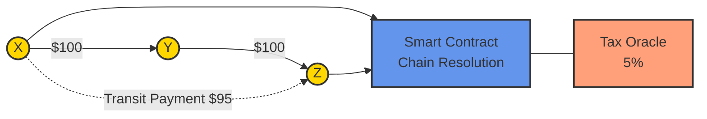
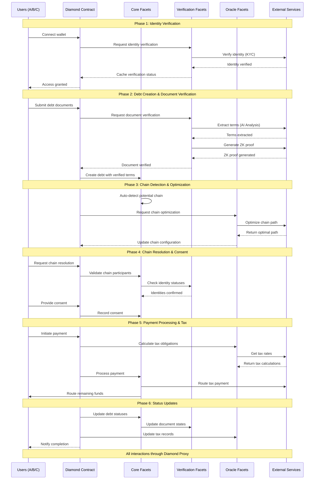

# CreditLoop: Blockchain-Based Debt Settlement Network

CreditLoop is a revolutionary blockchain-based system that transforms debt settlement through automated chain resolution. The system enables trustless payment routing through complex debt networks, significantly improving settlement efficiency, regulatory compliance, and economic transparency.

For detailed system flows and architectural diagrams, visit our [Miro board](https://miro.com/app/board/uXjVLyA4LL8=/).

## Overview



When entity X owes Y and Y owes Z, CreditLoop allows Z to directly claim payment from X, automatically updating all intermediate contracts without requiring intermediary action. The system leverages the ERC-2535 Diamond pattern and implements sophisticated algorithms for chain detection and resolution.


## Key Features

- **Automated Chain Resolution**: Intelligent detection and resolution of debt chains
- **Smart Contract Architecture**: Built on ERC-2535 Diamond pattern for modularity
- **Regulatory Compliance**: Integrated KYC/AML and tax reporting
- **Economic Efficiency**: Reduces trapped capital and improves money velocity
- **Transparent Operations**: Full visibility into debt relationships and settlements

## System Flow



### Flow Phases Explained

1. **Identity Verification**
   - Users connect their wallets to initiate interaction
   - System verifies identity through KYC process
   - Verification status is cached for future interactions

2. **Debt Creation & Document Verification**
   - Smart AI analysis of debt documents
   - ZK proofs generation for privacy
   - Automated term extraction and verification

3. **Chain Detection & Optimization**
   - Automatic detection of potential debt chains
   - Path optimization for efficient settlement
   - Real-time chain configuration updates

4. **Chain Resolution & Consent**
   - Validation of all participants in the chain
   - Identity status verification for each party
   - Secure consent collection and recording
   - Multi-signature approval process

5. **Payment Processing & Tax**
   - Real-time tax obligation calculation
   - Automated tax withholding and routing
   - Smart payment splitting and distribution
   - Compliance with jurisdictional requirements

6. **Status Updates**
   - Atomic debt status updates across chain
   - Document state synchronization
   - Tax record maintenance
   - Real-time notification to all participants
   - Audit trail generation for compliance

[Continue with other phases...]

## System Architecture

```mermaid
graph TB
    %% External Actors
    User((User))
    Admin((Admin))

    subgraph Diamond["Diamond Contract (Proxy)"]
        direction TB
        
        subgraph CoreFacets["Core Facets"]
            direction LR
            DF[DebtFacet]
            CF[ChainFacet]
            PF[PaymentFacet]
            AF[AccessControlFacet]
            TF[TaxFacet]
        end
        
        subgraph VerificationFacets["Verification Facets"]
            direction LR
            IV[IdentityVerifierFacet]
            DV[DocumentVerifierFacet]
        end
        
        subgraph OracleFacets["Oracle Facets"]
            direction LR
            TO[TaxOracleFacet]
            CO[ChainOptimizerFacet]
        end
    end

    subgraph Storage["Diamond Storage"]
        direction LR
        DS[(DebtStorage)]
        CS[(ChainStorage)]
        AS[(AccessStorage)]
        TSt[(TaxStorage)]
        VS[(VerificationStorage)]
    end
    
    subgraph ExternalSystems["External Systems"]
        direction LR
        TS[Tax Service]
        OS[Optimization Service]
        IS[Identity Service]
        DS_EXT[Document Verification Service]
        AI[AI Document Analysis]
        ZK[ZK Proof Service]
    end

    %% User flows through Diamond
    User --> Diamond
    Diamond --> DF
    Diamond --> CF
    Diamond --> PF
    
    %% Admin flows through Diamond
    Admin --> Diamond
    Diamond --> AF
    Diamond --> TF
    
    %% Core Facet Storage Interactions
    DF <-->|"Store/Read Debt Data"| DS
    CF <-->|"Store/Read Chain Data"| CS
    PF <-->|"Store/Read Payment Data"| DS
    PF <-->|"Read Tax Data"| TSt
    AF <-->|"Store/Read Access Rights"| AS
    TF <-->|"Store/Read Tax Data"| TSt
    
    %% Verification Flows
    IV <-->|"Verify Identity"| IS
    DV <-->|"Verify Documents"| DS_EXT
    DV <-->|"AI Analysis"| AI
    DV <-->|"ZK Proofs"| ZK
    
    %% Oracle-External System Interactions
    TO <-->|"Get Tax Rates/Submit Reports"| TS
    CO <-->|"Get Optimal Routes"| OS
    
    %% Cross-Facet Dependencies
    DF -->|"Check Identity"| IV
    DF -->|"Verify Debt Docs"| DV
    CF -->|"Verify Access"| AF
    PF -->|"Verify Access"| AF
    PF -->|"Calculate Tax"| TF
    
    %% Storage Interactions for Verification
    IV <-->|"Cache Identity Status"| VS
    DV <-->|"Cache Doc Verification"| VS
    
    classDef coreStyle fill:#6495ED,stroke:#333,stroke-width:2px
    classDef verificationStyle fill:#FF69B4,stroke:#333,stroke-width:2px
    classDef oracleStyle fill:#DDA0DD,stroke:#333,stroke-width:2px
    classDef externalStyle fill:#98FB98,stroke:#333,stroke-width:2px
    classDef storageStyle fill:#FFA07A,stroke:#333,stroke-width:2px
    classDef proxyStyle fill:#E6E6FA,stroke:#333,stroke-width:4px
    classDef actorStyle fill:#FFD700,stroke:#333,stroke-width:2px
    
    class DF,CF,PF,AF,TF coreStyle
    class IV,DV verificationStyle
    class TO,CO oracleStyle
    class TS,OS,IS,DS_EXT,AI,ZK externalStyle
    class DS,CS,AS,TSt,VS storageStyle
    class Diamond proxyStyle
    class User,Admin actorStyle
```



### Architecture Components

1. **Diamond Contract (Proxy)**
   - Central entry point for all interactions
   - Implements ERC-2535 Diamond pattern
   - Manages facet routing and upgrades

2. **Core Facets**
   - DebtFacet: Core debt management logic
   - ChainFacet: Chain detection and resolution
   - PaymentFacet: Payment processing
   - AccessControlFacet: Permission management
   - TaxFacet: Tax calculation and reporting

[Continue with other components...]

## Contract Structure

```
contracts/
├── core/
│   ├── DebtFacet.sol
│   ├── ChainFacet.sol
│   ├── PaymentFacet.sol
│   ├── AccessControlFacet.sol
│   └── TaxFacet.sol
├── verification/
│   ├── IdentityVerifierFacet.sol
│   └── DocumentVerifierFacet.sol
├── oracle/
│   ├── TaxOracleFacet.sol
│   └── ChainOptimizerFacet.sol
├── storage/
│   ├── DebtStorage.sol
│   ├── ChainStorage.sol
│   ├── AccessStorage.sol
│   ├── TaxStorage.sol
│   └── VerificationStorage.sol
├── interfaces/
│   ├── IDebtFacet.sol
│   ├── IChainFacet.sol
│   └── [Other interfaces...]
├── libraries/
│   ├── DataTypes.sol
│   ├── Events.sol
│   └── Errors.sol
└── Diamond.sol
```

### Contract Overview

1. **Core Contracts**
   - Implement primary business logic
   - Handle debt management and chain resolution
   - Manage payment processing and access control

2. **Verification Contracts**
   - Handle KYC and document verification
   - Integrate with external verification services
   - Manage identity and document states

3. **Oracle Contracts**
   - Interface with external data sources
   - Handle tax calculations and chain optimization
   - Provide real-time data updates

[Continue with previous content...]

## Economic Impact

CreditLoop addresses several key economic challenges:

1. **Capital Efficiency**
   - Reduces trapped capital in intermediary chains
   - Improves money velocity
   - Minimizes liquidity buffers

2. **Inflation Mitigation**
   - Reduces need for excessive money creation
   - Lowers transaction costs
   - Enables efficient capital utilization

3. **Market Transparency**
   - Real-time monitoring of payment flows
   - Better data for policy decisions
   - Enhanced systemic risk detection

## Technical Documentation

- [System Architecture](./docs/architecture.md)
- [Smart Contracts](./contracts/README.md)
- [API Documentation](./docs/api.md)
- [Deployment Guide](./docs/deployment.md)

## Visual Documentation
- [System Flow Diagrams](https://miro.com/app/board/uXjVLyA4LL8=/)
- [Technical Architecture](./diagrams/technical_architecture.png)
- [Network Flow Examples](./diagrams/network_flows.png)

## Research Paper

For detailed technical analysis and theoretical foundations, see our [research paper](./paper.pdf).

## Getting Started

### Prerequisites
- Node.js v14+
- Hardhat
- Ethereum development environment

### Installation
```bash
git clone https://github.com/yourusername/creditloop.git
cd creditloop
npm install
```

### Running Tests
```bash
npm run test
```

### Deployment
```bash
npm run deploy:testnet
```

## Contributing

Please read [CONTRIBUTING.md](CONTRIBUTING.md) for details on our code of conduct and the process for submitting pull requests.

## License

This project is licensed under the MIT License - see the [LICENSE](LICENSE) file for details.

## Contact

- **Project Lead**: Abbas Tolgay Yılmaz
- **Email**: tolgay@stateful.art
- **Website**: [creditloop.io](https://creditloop.io)

## Acknowledgments

- Research collaborators and contributors
- Early adopters and testing partners
- Academic advisors and industry experts

## Citation

If you use CreditLoop in your research, please cite:
```bibtex
@article{yilmaz2025creditloop,
  title={CreditLoop: A Novel Paradigm for Debt Contract Networks and Payment Flows},
  author={Yılmaz, Abbas Tolgay},
  journal={arXiv preprint},
  year={2025}
}
```
