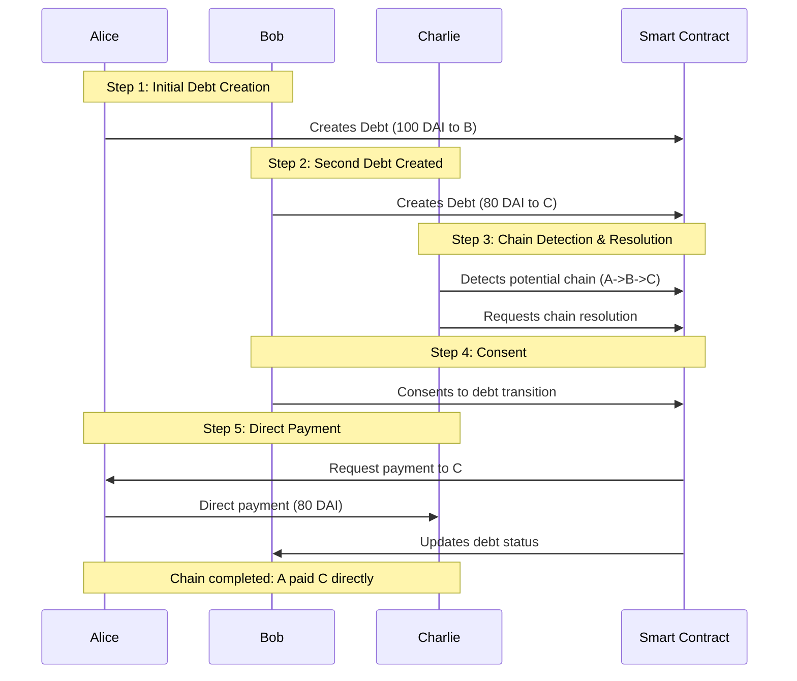

### Implementation Phases

#### Phase 1: Core Debt Management
1. **Bilateral Debt Creation**
   - Create debt agreements between two parties
   - Record debt details on-chain
   - Emit events for debt creation

2. **Basic Operations**
   - Query debt status
   - View debt history
   - Calculate remaining amounts

#### Phase 2: Chain Mechanics



### Technical Implementation

```solidity
interface IDebtFacet {
function createDebt(address creditor, uint256 amount) external;
function getDebt(bytes32 debtId) external view returns (Debt memory);
function resolveChain(address[] calldata path) external;
}
interface IChainFacet {
function findChain(address debtor, address creditor) external view returns (address[] memory);
function validateChain(address[] calldata path) external view returns (bool);
function executeChainPayment(address[] calldata path, uint256 amount) external;
}
interface IEventFacet {
event DebtCreated(bytes32 indexed debtId, address debtor, address creditor, uint256 amount);
event ChainResolved(address[] path, uint256 amount);
event DebtUpdated(bytes32 indexed debtId, uint256 newAmount, DebtStatus status);
}
```


### Security Considerations
1. **Access Control**
   - Role-based permissions
   - Chain validation checks
   - Reentrancy protection

2. **Chain Validation**
   - Prevent circular dependencies
   - Validate payment amounts
   - Check chain integrity

### Testing Strategy
1. **Unit Tests**
   - Individual debt creation
   - Chain detection
   - Payment routing

2. **Integration Tests**
   - Multi-party scenarios
   - Edge cases
   - Gas optimization

### Future Enhancements
1. **Phase 4: Advanced Features**
   - Multiple stablecoin support
   - Partial chain resolution
   - Debt tokenization

2. **Phase 5: Integration**
   - Cross-chain support
   - DeFi protocol integration
   - Analytics dashboard

### Future Enhancements (continued)

3. **Phase 6: Network Growth**
   - Incentive mechanisms for chain formation
   - Reputation system for reliable debtors
   - Automated chain optimization algorithms

4. **Phase 7: Advanced Chain Operations**
   ```mermaid
   graph TD
       A[Chain Detection] --> B[Optimization]
       B --> C[Auto-Resolution]
       B --> D[Chain Splitting]
       B --> E[Chain Merging]
       C --> F[Settlement]
   ```

### Economic Model

1. **Gas Optimization**
   - Batch processing for multiple chain resolutions
   - Efficient path finding algorithms
   - State compression techniques

2. **Fee Structure**
   - Optional convenience fee for automatic chain resolution
   - Gas cost sharing mechanisms
   - Incentives for chain participants

### Governance Structure

1. **Protocol Parameters**
   ```solidity
   struct ProtocolParams {
       uint256 minDebtAmount;
       uint256 maxChainLength;
       uint256 resolutionTimeout;
       uint256 convenienceFee;
   }
   ```

2. **Upgrade Mechanism**
   - Diamond standard upgrades
   - Parameter adjustment voting
   - Emergency pause functionality

### Risk Mitigation

1. **Circuit Breakers**
   - Maximum chain length limits
   - Transaction value caps
   - Rate limiting for large operations

2. **Recovery Mechanisms**
   - Dispute resolution process
   - Chain reversal capabilities
   - Emergency shutdown procedures

### Monitoring and Analytics

1. **On-chain Metrics**
   ```solidity
   interface IAnalyticsFacet {
       function getTotalDebtVolume() external view returns (uint256);
       function getActiveChains() external view returns (uint256);
       function getAverageResolutionTime() external view returns (uint256);
       event ChainMetricsUpdated(
           uint256 totalVolume,
           uint256 activeChains,
           uint256 avgResolutionTime
       );
   }
   ```

2. **Performance Monitoring**
   - Chain resolution success rate
   - Gas usage patterns
   - Network health indicators

### Documentation and Support

1. **Technical Documentation**
   - Smart contract architecture
   - Integration guides
   - API references

2. **User Guides**
   - Chain participation best practices
   - Risk management guidelines
   - Troubleshooting procedures

### Compliance and Legal

1. **Regulatory Considerations**
   - KYC/AML integration options
   - Regulatory reporting capabilities
   - Compliance documentation

2. **Privacy Features**
   - Optional privacy preserving mechanisms
   - Selective disclosure controls
   - Data retention policies

### Debt Collection Mechanisms

1. **Direct Settlement Mode**
   ```mermaid
   sequenceDiagram
       participant D as Debtor
       participant C as Creditor
       participant S as Smart Contract

       Note over D,C: Option 1: Direct Progressive Settlement
       D->>S: Sends partial payment
       S->>C: Forwards payment immediately
       S->>S: Updates debt status
       Note over D,C: Repeats until fully paid
   ```

2. **Escrow Settlement Mode**
   ```mermaid
   sequenceDiagram
       participant D as Debtor
       participant E as Escrow
       participant C as Creditor
       participant S as Smart Contract

       Note over D,C: Option 2: Escrow-based Full Settlement
       C->>S: Opts for escrow settlement
       D->>E: Sends partial payment
       E->>E: Accumulates funds
       Note over E,C: When fully accumulated
       C->>E: Initiates withdrawal (pays fee)
       E->>C: Transfers full amount
       S->>S: Marks debt as settled
   ```

### Collection Configuration

```solidity
enum SettlementMode {
    DIRECT_PROGRESSIVE,
    ESCROW_FULL
}

struct DebtSettings {
    SettlementMode mode;
    uint256 minimumPartialAmount;
    bool autoWithdraw;
    address feeToken;
}

interface ISettlementFacet {
    function setSettlementPreferences(
        bytes32 debtId,
        DebtSettings calldata settings
    ) external;
    
    function withdrawFromEscrow(
        bytes32 debtId
    ) external;
    
    event SettlementConfigured(
        bytes32 indexed debtId,
        SettlementMode mode,
        uint256 minimumPartialAmount
    );
}

### Settlement Features

1. **Direct Progressive Settlement**
   - Immediate forwarding of payments
   - No escrow fees
   - Flexible partial payment amounts
   - Real-time debt status updates

2. **Escrow-based Full Settlement**
   - Funds accumulation in escrow
   - Single withdrawal transaction
   - Creditor pays transfer fee
   - Automated withdrawal option
   - Guaranteed full amount availability

### Implementation Details

```solidity
interface IEscrowFacet {
    function depositToEscrow(
        bytes32 debtId
    ) external payable;
    
    function getEscrowBalance(
        bytes32 debtId
    ) external view returns (uint256);
    
    function setAutoWithdraw(
        bytes32 debtId,
        bool enabled
    ) external;
    
    event EscrowFunded(
        bytes32 indexed debtId,
        uint256 amount,
        uint256 totalAccumulated
    );
    
    event EscrowWithdrawn(
        bytes32 indexed debtId,
        address indexed creditor,
        uint256 amount,
        uint256 fee
    );
}
