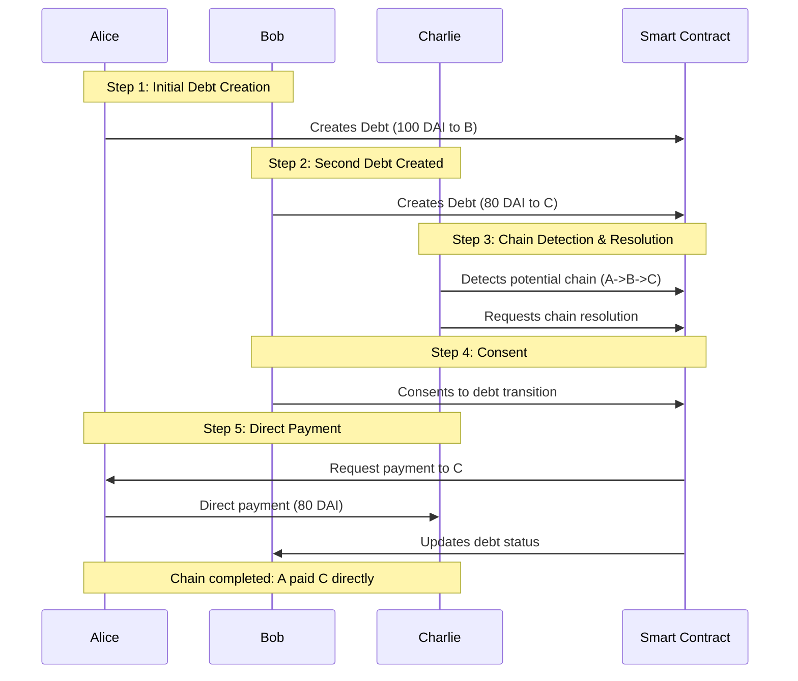
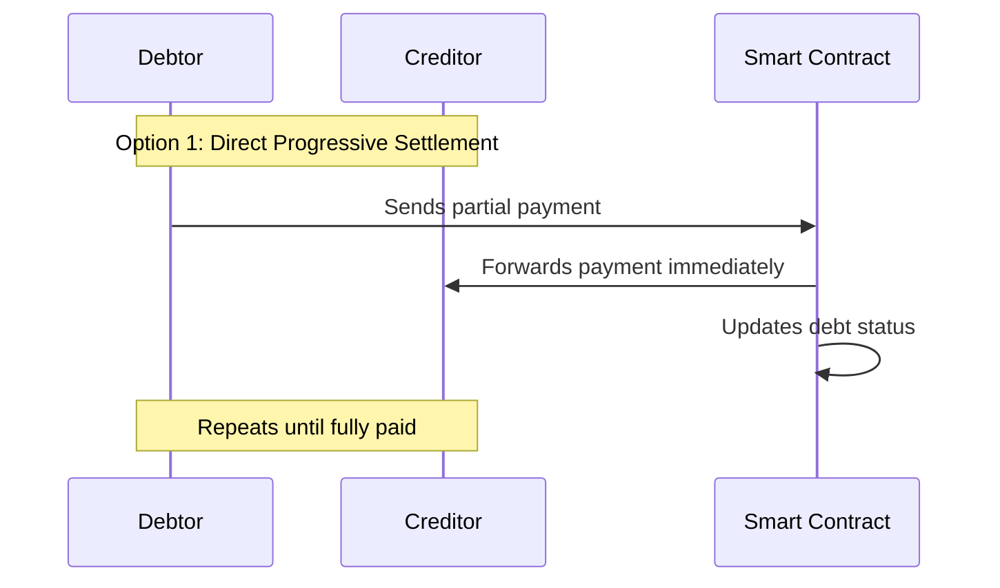
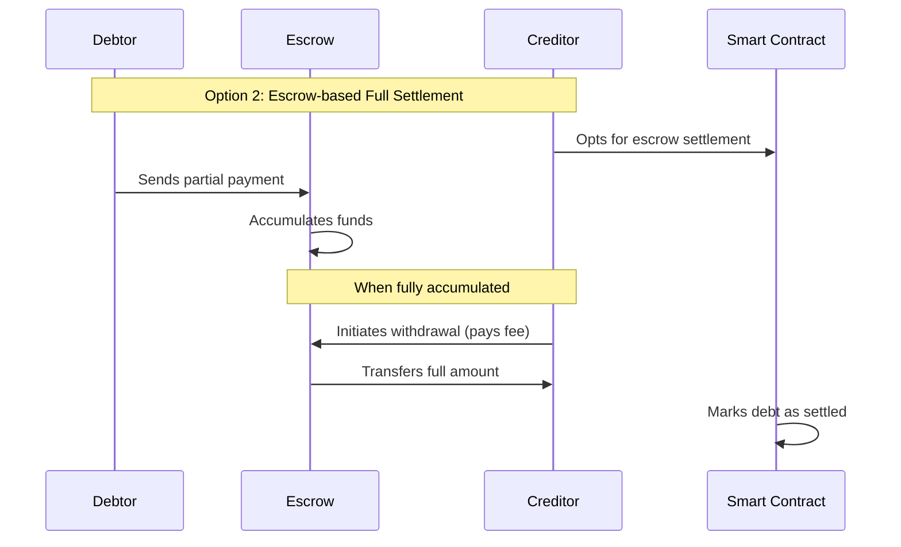
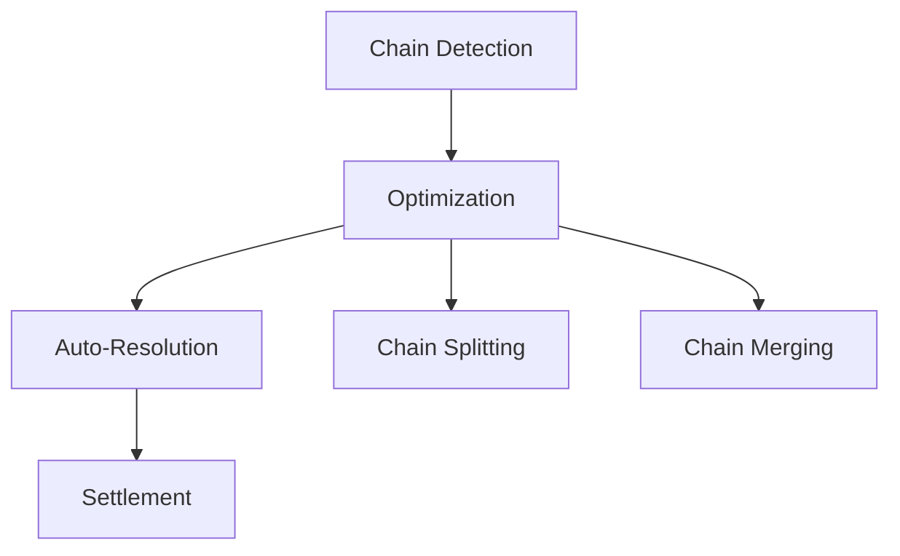
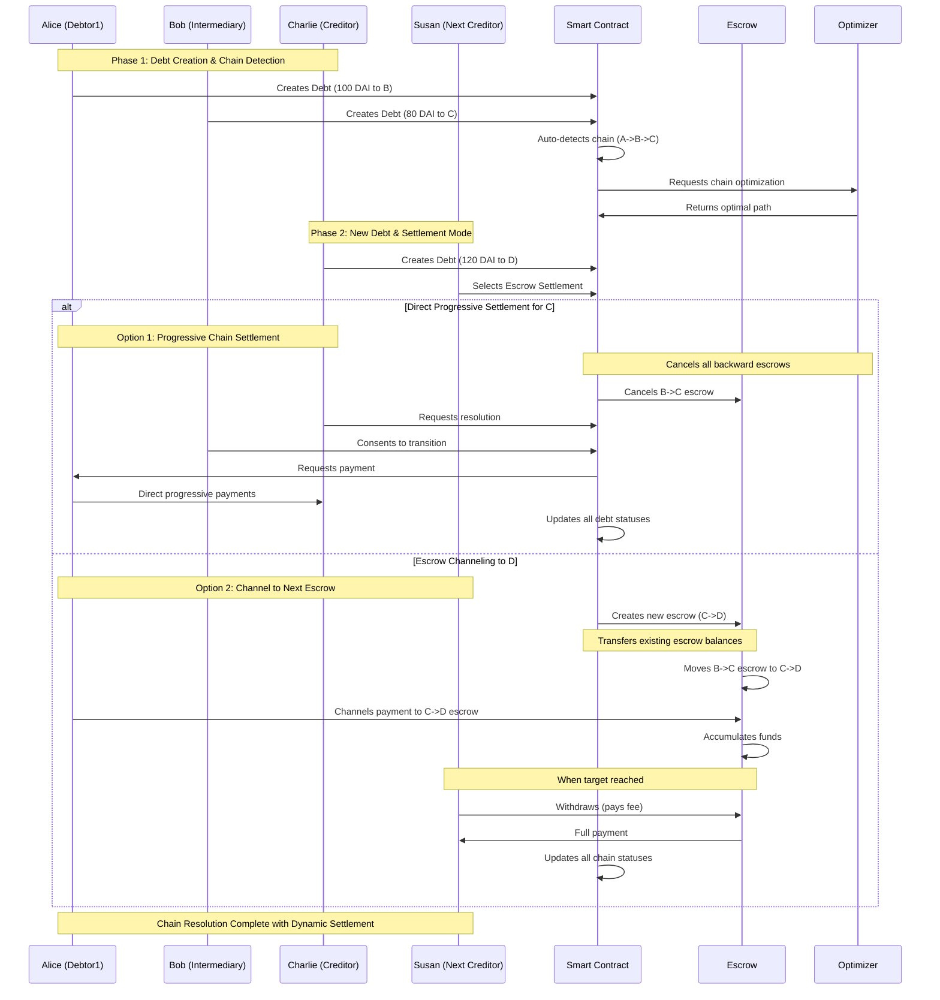
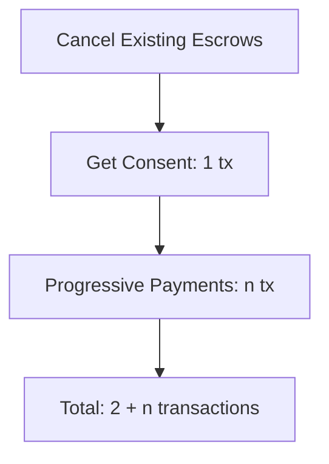
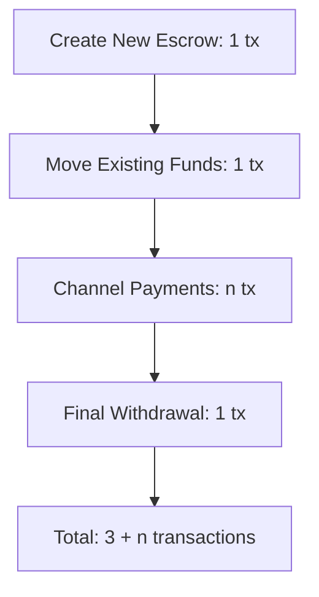
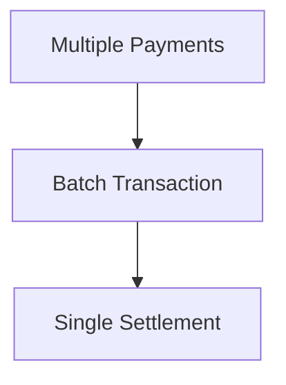
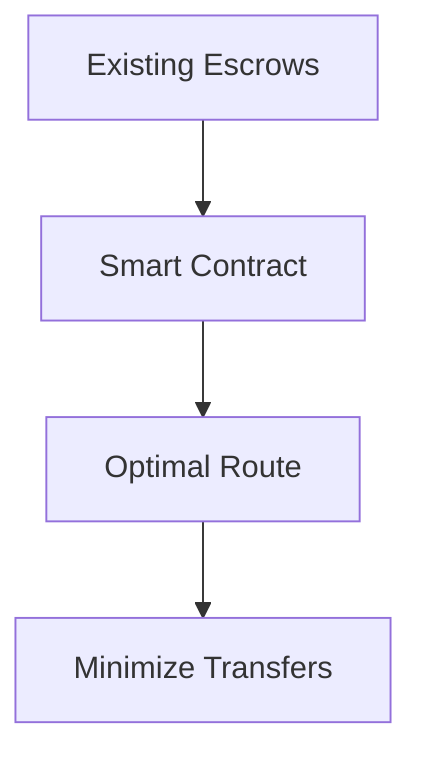

# Debt Chain System Flow

The Debt Chain system enables trustless debt management where creditors can track and collect debts through chains of relationships. When a debt is created, the creditor chooses their preferred settlement mode (direct progressive or escrow-based). In a chain scenario (e.g., Alice owes Bob, Bob owes Charlie), the final creditor (Charlie) can initiate chain resolution, requiring consent from intermediaries (Bob). Upon consent, the system enables direct payment from the initial debtor (Alice) to the final creditor (Charlie), automatically updating all intermediate debt statuses. The system supports both immediate progressive settlements and escrow-based full settlements, where creditors can opt to accumulate funds before withdrawal.

The smart contract automatically detects potential chains upon debt creation, before any settlement mode is selected. When a new debt is created (e.g., Charlie owes Susan), the settlement preference of the new creditor affects the entire upstream chain. If Susan chooses escrow-based settlement, all payments and accumulated funds from Charlie's debtors (including Alice and Bob) are automatically channeled to the new Charlie-Susan escrow. Conversely, if Charlie opts for progressive settlement, any existing escrows in the upstream chain (like Bob-Charlie escrow) are dissolved, enabling direct progressive payments from all debtors to Charlie.


### Core Debt Chain Flow


### Settlement Options

1. **Direct Progressive Settlement**


2. **Escrow-based Settlement**


### Chain Resolution Process


### Complete System Flow


### System Evaluation

#### Transaction Analysis

1. **Base Chain Formation (A->B->C)**
   - Initial transactions: 2 (A->B debt, B->C debt)
   - Chain detection: 0 (internal computation)
   - Optimization: 0 (internal computation)

2. **When D Enters (C->D with Escrow)**
Initial state: A->B->C->D

#### Option 1: Direct Progressive Settlement for C


**Efficiency**: Good when:
- Few payments expected
- No existing escrow contracts
- Quick settlement needed

**Inefficient when**:
- Many small payments expected
- Multiple escrows already exist

#### Option 2: Escrow Channeling to D


**Efficiency**: Good when:
- Existing escrows have significant balances
- Large number of small payments expected
- Final creditor (D) prefers single withdrawal

**Inefficient when**:
- Quick settlement needed
- Few large payments expected

### Optimization Opportunities

1. **Batch Processing**


- Could reduce n payments to fewer batched transactions
- Reduces overall gas costs
- Improves chain efficiency

2. **Smart Escrow Routing**


- Minimize escrow creation/movement transactions
- Intelligent fund consolidation
- Reduces intermediate steps

### Recommendations

1. **For Direct Progressive**:
   - Add payment batching
   - Implement minimum payment thresholds
   - Add optional timelock for consent

2. **For Escrow Channeling**:
   - Implement escrow merging
   - Add automatic threshold-based forwarding
   - Include emergency withdrawal mechanisms

3. **Alternative: Direct Progressive Only Approach**

   Benefits of removing escrow support:
   - Significantly reduced system complexity
   - Fewer smart contracts to maintain and audit
   - Lower gas costs (no escrow deployment/management)
   - Simpler chain resolution logic
   - Clearer user experience
   - Faster settlements
   - Reduced attack surface

   Implementation focus would shift to:
   - Efficient payment batching
   - Optimized chain detection
   - Better consent management
   - Improved transaction bundling

   Trade-offs to consider:
   - Less flexibility for creditors
   - No option for accumulating funds
   - May not suit all use cases

   ```mermaid
   graph TD
       A[Direct Settlement Only] --> B[Reduced Complexity]
       A --> C[Lower Gas Costs]
       A --> D[Faster Resolution]
       A --> E[Better Security]

       B --> F[Simplified Codebase]
       C --> G[Cheaper Operations]
       D --> H[Better UX]
       E --> I[Easier Audits]
   ```