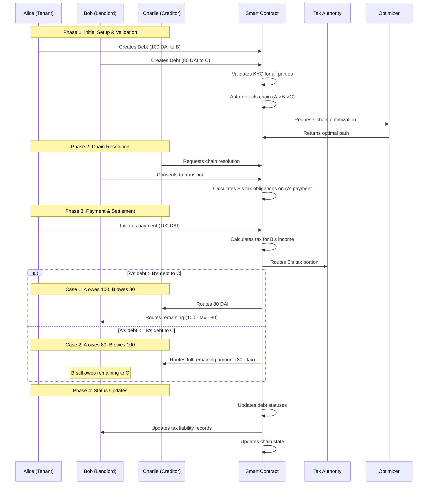

# DebtChain System Flow

## System Components

### Core Components
1. Diamond Contract (Main Proxy)
2. Core Facets (Debt, Chain, Payment, Access Control)
3. Oracle Facets (Tax, Chain Optimizer)
4. Verification Facets (Identity, Document)
5. Storage Libraries

### External Services
1. Identity Verification Service
2. Document Verification Service
3. AI Analysis Service
4. ZK Proof Service
5. Tax Service
6. Chain Optimization Service

## Verification System

### Identity Verification
1. **Purpose**
   - One-time wallet verification
   - Basic system access control
   - Participant validation

2. **Process**
   - User completes KYC through external service
   - Identity service verifies documents
   - System caches verification status
   - Status enables system access

3. **States**
   - Unverified
   - Pending Verification
   - Verified
   - Expired
   - Revoked

### Document Verification
1. **Purpose**
   - Verify debt agreement authenticity
   - Extract and validate terms
   - Ensure privacy of sensitive data
   - Track document lifecycle

2. **Process**
   - Document submission
   - AI-powered term extraction
   - Authenticity verification
   - ZK proof generation
   - Status updates and tracking

3. **Document States**
   - Pending Verification
   - Verified
   - Failed Verification
   - Revoked
   - Replaced
   - Expired

   

4. **Lifecycle Management**
   - Initial verification
   - Status tracking
   - Revocation handling
   - Document replacement
   - History maintenance

## System Flows

### 1. User Registration
1. User connects wallet
2. Completes identity verification
3. System caches verification status
4. Access granted upon success

### 2. Debt Creation
1. User submits debt documents
2. System verifies user identity
3. Document verification process:
   - Term extraction
   - Authenticity check
   - ZK proof generation
4. Debt created with verified terms
5. Document status tracked

### 3. Chain Formation
1. Verify all participant identities
2. Validate all debt documents
3. Check document statuses
4. Optimize chain configuration
5. Create chain with verified data

### 4. Payment Processing
1. Verify participant identities
2. Validate payment against documents
3. Calculate taxes
4. Process payment
5. Update chain status

## Security Measures

### Identity Security
1. External KYC service integration
2. Cached verification status
3. Regular status updates
4. Revocation capability
5. Access control enforcement

### Document Security
1. AI-powered verification
2. ZK proofs for privacy
3. Document state tracking
4. Revocation handling
5. Version control
6. History maintenance

### Transaction Security
1. Identity verification checks
2. Document validation
3. Terms compliance
4. Payment verification
5. State updates

## Error Handling

### Verification Errors
1. Identity verification failure
2. Document verification failure
3. Term extraction issues
4. ZK proof generation failure
5. Status update errors

### Document Lifecycle Errors
1. Invalid document submission
2. Failed verification
3. Revocation issues
4. Replacement errors
5. Expiry handling

### System Response
1. Clear error messages
2. Failure reason tracking
3. Recovery procedures
4. Status rollbacks
5. Event logging

## Event System

### Identity Events
1. Verification Requested
2. Verification Complete
3. Status Updated
4. Identity Expired
5. Identity Revoked

### Document Events
1. Submission
2. Verification Status
3. Term Extraction
4. Revocation
5. Replacement
6. Expiry

### System Events
1. Debt Creation
2. Chain Formation
3. Payment Processing
4. Error Occurrence
5. Status Updates

## Storage Management

### Identity Storage
1. Verification status
2. Timestamps
3. Request history
4. Access permissions

### Document Storage
1. Document hashes
2. Verification status
3. Term proofs
4. Version history
5. Revocation records

### System Storage
1. Debt records
2. Chain configurations
3. Payment history
4. Tax calculations
5. System parameters 